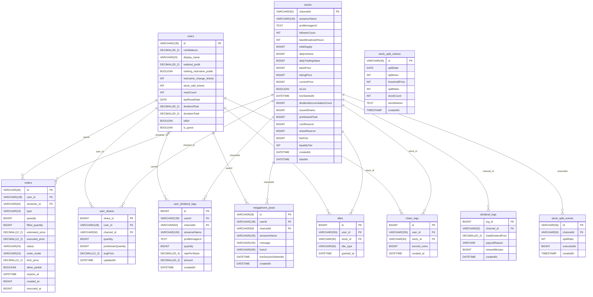

# Spotchzxk 백엔드 구조 발표 자료

작성일: 2026-06-08 / 최종 업데이트: 2026-06-10  
기준 코드: `backend/src/main/java/com/spotchzxk`

---

## 1. 프로젝트 개요

치지직(Chzzk) 스트리머를 주식처럼 사고 파는 모의 주식 거래 시뮬레이터.  
스트리머가 라이브 중일 때 10분마다 배당을 지급하고, CPAMM(Constant Product AMM) 모델로 주가를 결정한다.

**Tech Stack**

| 구분 | 내용 |
|------|------|
| Language | Java 17 |
| Framework | Spring Boot 3.5.0 |
| ORM | Spring Data JPA (Hibernate) |
| DB | MySQL + Flyway 마이그레이션 |
| 인증 | Firebase Admin SDK (ID Token) |
| 실시간 | WebSocket + STOMP (SockJS) |
| 외부 연동 | Chzzk OpenAPI (채널 정보 조회) |
| 빌드 | Gradle |

---

## 2. 패키지 구조 및 기능별 파일 설명

```
backend/src/main/java/com/spotchzxk/
├── SpotchzxkApplication.java          # 애플리케이션 진입점
│
├── config/
│   ├── FirebaseConfig.java            # Firebase Admin SDK 초기화
│   ├── FlywayConfig.java              # DB 마이그레이션 설정
│   ├── SecurityConfig.java            # Spring Security — 공개/인증 경로 분리
│   └── WebSocketConfig.java           # STOMP 엔드포인트(/ws), 토픽 프리픽스 설정
│
├── controller/                        # HTTP 요청 수신 — 유효성 검증 후 Service 호출
│   ├── AuthController.java            # GET /api/auth/me — 인증 상태 확인
│   ├── AccountLinkController.java     # POST /api/auth/link-google — 게스트→Google 계정 병합
│   ├── GuestController.java           # POST /api/guest/register — 디바이스 지문 기반 게스트 등록
│   ├── StockController.java           # GET /api/stocks, POST /api/stocks — 종목 목록/등록
│   ├── CandleController.java          # GET /api/stocks/{id}/candles — OHLC 캔들 조회
│   ├── TradeController.java           # POST /api/trade — 매수/매도 주문 제출
│   ├── OrderController.java           # GET /api/orders, /recent, /history — 주문 조회
│   ├── PortfolioController.java       # GET/POST /api/portfolio — 잔고·보유 주식 조회/초기화
│   ├── DividendController.java        # GET /api/dividends/recent, /my — 배당 내역 조회
│   ├── RankingController.java         # GET /api/rankings — 실현손익/배당 순위 조회
│   ├── ProfileController.java         # POST /api/profile/nickname, /ranking-nickname-public
│   ├── ShopController.java            # GET/POST /api/shop/megaphone, POST /api/shop/items/purchase
│   ├── AnnouncementController.java    # GET /api/announcements/stock-splits/latest — 주식 분할 공지
│   ├── DonationController.java        # POST /api/donate — 코인 소각(응원) 기록 및 후원왕 랭킹 기여
│   ├── AdminController.java           # POST /api/admin/amm/migrate — AMM 풀 수동 마이그레이션 (API Key 인증)
│   └── OnlineController.java          # GET /api/online-count — 현재 접속자 수
│
├── service/                           # 비즈니스 로직
│   ├── TradeEngine.java               # 거래 핵심 엔진 — 잔고 검증, 체결, 가격 갱신, WebSocket 발행
│   ├── StockService.java              # 종목 등록 — Chzzk API 조회 → DB 저장, 티켓 차감
│   ├── StockSplitService.java         # 주식 분할 — 00/06/12/18시 KST (6시간마다), 1,000,000원 초과 종목 10:1 분할
│   ├── CandleService.java             # 주문 이력에서 OHLC 캔들 집계 (1m/5m/1h/1d/1w)
│   ├── DividendService.java           # 1시간 인터벌 배당 지급 — preStreamQuantity 스냅샷 기준, 0.01%/주
│   ├── ChzzkApiClient.java            # Chzzk OpenAPI HTTP 클라이언트 (채널 정보/팔로워 수 조회)
│   ├── ChzzkLivePollingService.java   # 60초 간격 라이브 상태 폴링 + 1초 간격 배당 tick (60분 주기)
│   ├── AmmMigrationService.java       # AMM 풀 초기화/마이그레이션 — 기존 종목에 CPAMM 풀 설정
│   ├── DailyResetService.java         # 매일 자정 KST — 일일 거래량 초기화, 가격 보정, 랭킹 초기화
│   ├── PortfolioService.java          # 포트폴리오 조회 및 초기화 (하루 3회 제한)
│   ├── AccountLinkService.java        # 게스트 계정 → Google 계정 데이터 이전 및 병합
│   ├── GuestService.java              # 게스트 등록 — 디바이스 지문 중복 체크 → User 생성
│   ├── ProfileService.java            # 닉네임 변경 (티켓 차감), 랭킹 공개 여부 설정
│   ├── MegaphoneService.java          # 확성기 사용 — 라이브 확인, 원화 잔액 차감, 게시글 저장
│   ├── ShopItemService.java           # 상점 아이템 구매 — 닉네임 변경권/종목 추가권
│   ├── OnlineUserService.java         # 접속자 수 관리 (WebSocket 세션 기반)
│   ├── EnvResolver.java               # 환경변수/설정값 통합 접근 유틸
│   ├── bot/
│   │   ├── BotActivityService.java    # 봇 계정 자동 매매 — 거래 활성화를 위한 시장 참여자
│   │   └── BotActivityProperties.java # 봇 설정값 (활성화 여부, 거래 주기 등)
│   └── system/
│       ├── SystemSellPressureService.java    # 시스템 매도 압박 — 가격 폭등 억제용 자동 매도
│       └── SystemSellPressureProperties.java # 매도 압박 설정값 (임계치, 수량, 쿨다운 등)
│
├── policy/
│   └── AntiWhalePolicy.java           # 신규 상장 anti-whale 정책 상수 (24h 내 200주 상한)
│
├── entity/                            # JPA 엔티티 (DB 테이블 매핑)
│   ├── User.java                      # users — 사용자 계정, 잔고, 티켓, 리셋 정보
│   ├── Stock.java                     # stocks — 종목(스트리머), 현재가, 상장가, 발행량, 라이브 상태
│   ├── Order.java                     # orders — 매수/매도 주문 이력 (시장가/지정가, quantity BIGINT)
│   ├── UserShare.java                 # user_shares — 사용자별 종목 보유량 및 평균단가
│   ├── DividendLog.java               # dividend_logs — 배당 이벤트 로그 (종목별)
│   ├── UserDividendLog.java           # user_dividend_logs — 사용자별 배당 수령 내역
│   ├── DeviceMapping.java             # device_mappings — 디바이스 지문 ↔ UID 매핑
│   ├── MegaphonePost.java             # megaphone_posts — 확성기 게시글 (라이브 세션 타임스탬프 포함)
│   ├── StockSplitNotice.java          # stock_split_notices — 일별 주식 분할 공지
│   └── StockSplitEvent.java           # stock_split_events — 종목별 주식 분할 실행 이력
│
├── repository/                        # Spring Data JPA 리포지토리
│   ├── UserRepository.java            # 랭킹 조회(상위 50명), 잔고/손익/티켓 증감, 닉네임 변경, 일일 랭킹 초기화
│   ├── StockRepository.java           # 라이브 중인 종목 조회, 현재가 기준 필터 (주식 분할 대상 탐색)
│   ├── OrderRepository.java           # 주문 이력 조회, 지정가 호가창 집계, 주식 분할 시 미체결 주문 일괄 보정
│   ├── UserShareRepository.java       # 보유량 조회, 배당 일괄 지급(벌크 UPDATE), 라이브 시작 시 preStreamQuantity 스냅샷, 주식 분할 적용
│   ├── DividendLogRepository.java     # 최근 배당 이벤트 30건 조회
│   ├── UserDividendLogRepository.java # 사용자별 배당 수령 내역 최근 50건 조회
│   ├── DeviceMappingRepository.java   # 디바이스 지문 ↔ UID 매핑, 계정 병합 시 UID 일괄 갱신
│   ├── MegaphonePostRepository.java   # 오늘 사용 횟수 카운트, 라이브 채널 최신 게시글 페이지 조회
│   ├── StockSplitNoticeRepository.java # (날짜+시간) 기준 분할 공지 존재 여부 확인 및 단건 조회 (중복 방지)
│   └── StockSplitEventRepository.java  # 특정 종목의 분할 실행 이력 조회 (캔들 보정용)
│
├── dto/                               # 요청/응답 데이터 전송 객체
│   ├── TradeRequest.java              # 거래 요청 (streamerId, type, quantity, estimatedPrice)
│   ├── TradeResponse.java             # 거래 응답 (status, executedPrice, newBalance 등)
│   ├── OhlcCandle.java                # 캔들 데이터 (bucketStart, open, high, low, close)
│   ├── OrderBookDto.java              # 호가창 데이터
│   ├── GuestRegisterRequest.java      # 게스트 등록 요청 (fingerprint, uid)
│   └── LinkGoogleRequest.java         # Google 계정 연동 요청 (guestUid)
│
├── security/
│   └── FirebaseTokenFilter.java       # 모든 요청에서 Bearer 토큰 검증 → SecurityContext 주입
│
└── exception/
    ├── ChannelNotFoundException.java          # 채널 조회 실패
    ├── InsufficientFollowerCountException.java # 팔로워 수 기준 미달
    └── ResetLimitExceededException.java        # 포트폴리오 초기화 횟수 초과
```

---

## 3. 주요 기능 흐름

### 거래 흐름

```
클라이언트
  └─ POST /api/trade
        └─ TradeController
              └─ TradeEngine.submitTrade()
                    ├─ 잔고/보유량 검증
                    ├─ CPAMM 가격 모델로 체결가 계산
                    │     price = coinReserve / shareReserve  (constant product: x*y=k)
                    │     매수: coinReserve 증가, shareReserve 감소
                    │     매도: shareReserve 증가, coinReserve 감소
                    ├─ AntiWhalePolicy — 신규 상장 24h 내 200주 매수 상한
                    ├─ User 잔고 차감/증가
                    ├─ UserShare 수량/평균단가 갱신
                    ├─ Order 저장 (status=completed)
                    └─ WebSocket 발행
                          ├─ /topic/prices/{channelId}
                          ├─ /topic/trades
                          └─ /topic/candles/{channelId}
```

### 배당 흐름

```
ChzzkLivePollingService (@Scheduled fixedDelay=60_000)
  └─ 라이브 상태 감지
        ├─ 라이브 시작 시
        │     ├─ liveStartedAt 기록
        │     └─ userShare.preStreamQuantity 스냅샷 저장
        │           (라이브 시작 시점 보유량만 배당 대상)
        └─ 라이브 종료 시: isLive=false, 배당 없음

ChzzkLivePollingService (@Scheduled fixedDelay=1_000)
  └─ payDueIntervalDividends()
        └─ 라이브 중인 종목 중 경과시간/60분 > dividendAccumulationCount 인 것 처리
              (DIVIDEND_INTERVAL_MINUTES=60, due date 오래된 순 — FIFO, 틱당 최대 1종목)
              └─ DividendService.payIntervalDividend(stock)
                    ├─ ratePerShare = currentPrice × 0.0001  (0.01%/시간)
                    ├─ preStreamQuantity > 0 인 보유자에게 원화 지급
                    │     (제외: __house__ 계정, isBot=true)
                    ├─ UserDividendLog 저장
                    ├─ dividendAccumulationCount 증가
                    ├─ 트랜잭션 커밋 후 사용자 캐시 무효화
                    └─ WebSocket 발행 (트랜잭션 커밋 후)
                          ├─ /topic/dividends       (전체 배당 피드)
                          └─ /topic/user-dividends/{userId}  (개인 알림)
```

### 주식 분할 흐름

```
StockSplitService (@Scheduled cron="0 0 0/6 * * *" KST — 00/06/12/18시)
  └─ 해당 (날짜, 시간) 분할 공지가 없는 경우에만 실행 (하루 최대 4회 독립 실행)
        └─ currentPrice > 1,000,000 인 종목 필터
              ├─ event- 종목 제외
              └─ 상장 24h 미경과 종목 제외 (AntiWhalePolicy.NEW_LISTING_HOURS=24)
                    └─ 대상 종목 10:1 분할
                          ├─ stock.applyStockSplit(10)
                          │     currentPrice/10, basePrice/10, listingPrice/10
                          │     totalSupply×10, issuedShares×10, dailyVolume×10
                          │     shareReserve×10  (coinReserve 불변 — AMM 가격 자동 조정)
                          ├─ userShare 수량 ×10, preStreamQuantity ×10, avgPrice /10
                          ├─ 미체결 지정가 주문 수량 ×10, limitPrice /10, estimatedPrice /10
                          ├─ StockSplitNotice 저장 (날짜+시간 단위 1건)
                          ├─ StockSplitEvent 저장 (종목별)
                          ├─ 트랜잭션 커밋 후: TradeEngine/CandleService/SystemSellPressure 캐시 무효화
                          └─ 트랜잭션 커밋 후: WebSocket 발행
                                ├─ /topic/streamers
                                ├─ /topic/prices/{channelId}
                                └─ /topic/stock-split-notices
```

### 시스템 매도 압박 흐름

```
SystemSellPressureService (@Scheduled fixedDelay=1_000)
  └─ 활성화된 경우 전체 종목 중 기준가 대비 상승률이 startGainPercent 이상인 종목 탐색
        └─ PressureState (TTL 6~24h) 기반 tier 결정
              ├─ weak   (상승률 기준 초과 200% 미만) — 소량/긴 인터벌
              ├─ medium (200~600%) — 중간
              ├─ strong (600~1200%) — 고량/짧은 인터벌
              └─ extreme (1200%+) — 매우 고량/매우 짧은 인터벌
                    └─ __system_sell_pressure__ 계정으로 시장가 매도 제출
                          (일별 한도, 연속 매도 후 쿨다운 적용)
```

### 종목 등록 흐름

```
클라이언트
  └─ POST /api/stocks { channelUrl }
        └─ StockController
              └─ StockService.addStockIfNew()
                    ├─ URL에서 channelId 파싱
                    ├─ ChzzkApiClient로 채널 정보 조회
                    ├─ 팔로워 수 기준 검증
                    ├─ 종목 추가 티켓 차감
                    ├─ Stock 엔티티 저장 (listingPrice 자동 계산)
                    └─ WebSocket /topic/streamers 발행
```

---

## 4. ERD



---

## 5. API 명세서

### 기본 정보

- Base URL: `http://localhost:8080`
- API Prefix: `/api`
- WebSocket Endpoint: `/ws` (SockJS + STOMP)
- 인증: `Authorization: Bearer {Firebase ID Token}`

### 인증 정책

| 구분 | 해당 API |
|------|---------|
| 공개 (토큰 불필요) | `GET /health`, `POST /api/guest/**`, `GET /api/auth/me`, `GET /api/stocks`, `GET /api/orders/recent`, `GET /api/orders/history`, `GET /api/announcements/**`, `/ws/**` |
| Google 계정 필요 | `POST /api/stocks` |
| 로그인 필요 | 위 공개 API 외 모든 API |

### 공통 에러 응답

```json
{ "error": "에러 메시지" }
```

| Status | 의미 |
|--------|------|
| 400 | 잘못된 요청 / 거래 실패 |
| 401 | 인증 필요 |
| 404 | 채널 또는 리소스 없음 |
| 409 | 이미 존재하는 종목 |
| 422 | 종목 등록 조건 미충족 (팔로워 수 기준 미달) |
| 429 | 포트폴리오 초기화 횟수 초과 |

---

### 인증 API

#### `GET /api/auth/me` — 인증 상태 확인
인증: 선택

```json
{
  "authenticated": true,
  "principal": "firebase-uid",
  "authorities": ["ROLE_GOOGLE"]
}
```

#### `POST /api/auth/link-google` — 게스트 → Google 계정 병합
인증: 필요  
요청: `{ "guestUid": "guest-firebase-uid" }`  
응답: `200 OK` (본문 없음)

---

### 게스트 API

#### `POST /api/guest/register` — 게스트 계정 등록
인증: 공개

요청:
```json
{ "fingerprint": "device-fingerprint", "uid": "firebase-uid" }
```
응답: `{ "uid": "firebase-uid" }`

---

### 종목 API

#### `GET /api/stocks` — 전체 종목 목록 조회
인증: 공개  
응답: `Stock[]`

#### `POST /api/stocks` — 종목 등록
인증: Google 계정 필요

요청:
```json
{ "channelUrl": "https://chzzk.naver.com/live/{channelId}" }
```

응답:
```json
{ "id": "channelId", "name": "스트리머명", "price": 10000, "totalVolume": 100000, "message": "종목이 추가되었습니다." }
```

#### `GET /api/stocks/{stockId}/candles` — OHLC 캔들 조회
인증: 필요

| 파라미터 | 기본값 | 설명 |
|----------|--------|------|
| `interval` | `5m` | `1m` / `5m` / `1h` / `1d` / `1w` |
| `count` | `50` | 반환 개수 |

응답:
```json
[{ "bucketStart": 1779696000000, "open": 10000, "high": 10500, "low": 9900, "close": 10200 }]
```

---

### 거래 API

#### `POST /api/trade` — 매수/매도 주문
인증: 필요

요청:
```json
{ "streamerId": "channelId", "type": "buy", "quantity": 10, "estimatedPrice": 10000 }
```

응답:
```json
{ "status": "executed", "executedPrice": 10500, "newBalance": 895000, "fee": 0, "orderId": "uuid", "orderMode": "market" }
```

> 신규 상장 후 24시간 이내 종목은 1회 매수 시 200주 상한 적용 (AntiWhalePolicy)

---

### 주문 API

| 메서드 | 경로 | 인증 | 설명 |
|--------|------|------|------|
| GET | `/api/orders` | 필요 | 내 주문 전체 (최신순) |
| GET | `/api/orders/recent` | 공개 | 전체 최근 주문 50개 |
| GET | `/api/orders/history?streamerId={id}` | 공개 | 특정 종목 체결 이력 최신순 200개 |

주문 객체 구조:

| 필드 | 타입 | 설명 |
|------|------|------|
| `id` | string | 주문 UUID |
| `userId` | string | Firebase UID |
| `streamerId` | string | 종목 채널 ID |
| `type` | string | `buy` / `sell` |
| `quantity` | number | 수량 (BIGINT) |
| `estimatedPrice` | number | 요청 시 추정가 |
| `executedPrice` | number | 체결가 |
| `status` | string | `completed` / `pending` / `cancelled` |
| `orderMode` | string | `market` / `limit` |
| `limitPrice` | number/null | 지정가 |
| `createdAt` | number | epoch milliseconds |

---

### 포트폴리오 API

#### `GET /api/portfolio` — 포트폴리오 조회
인증: 필요

```json
{
  "balance": 1000000,
  "shares": { "channelId": 10 },
  "avgPrices": { "channelId": 10000 },
  "dividendTotal": 0,
  "remainingResets": 3
}
```

#### `POST /api/portfolio/reset` — 포트폴리오 초기화
인증: 필요  
제약: 보유 주식 없음 + 미체결 주문 없음 + KST 하루 3회 이하

---

### 배당 API

#### `GET /api/dividends/recent` — 최근 배당 이벤트 30개
인증: 공개

```json
[{ "channelId": "...", "streamerName": "...", "profileImageUrl": "...", "totalDividendPool": 10000, "streamMinutes": 0, "createdAt": "..." }]
```

#### `GET /api/dividends/my` — 내 배당 수령 내역 (최근 50개)
인증: 필요

```json
[{ "channelId": "...", "streamerName": "...", "quantity": 10, "ratePerShare": 12.5, "amount": 125, "createdAt": "..." }]
```

---

### 랭킹 API

#### `GET /api/rankings?type={type}` — 상위 50명 랭킹 조회
인증: 공개

| type | 설명 |
|------|------|
| `realized` (기본) | 실현 손익 순위 |
| `dividend` | 배당 수령 합계 순위 |
| `donation` | 후원(코인 소각) 합계 순위 |

응답:
```json
[{ "rank": 1, "displayName": "트레이더", "value": 500000, "realizedProfit": 500000, "dividendTotal": 12000 }]
```

> `rankingNicknamePublic = false`인 사용자는 `displayName`이 `"비공개"`로 표시됨

---

### 프로필 API

#### `POST /api/profile/nickname` — 닉네임 변경
인증: 필요  
요청: `{ "displayName": "새닉네임" }`  
응답: `{ "displayName": "새닉네임" }`  
제약: 닉네임 변경 티켓 소모

#### `POST /api/profile/ranking-nickname-public` — 랭킹 닉네임 공개 설정
인증: 필요  
요청: `{ "isPublic": true }`  
응답: `{ "rankingNicknamePublic": true }`

---

### 상점 API

#### `GET /api/shop/megaphone/posts` — 확성기 게시글 목록 (최근 20개)
인증: 필요

#### `GET /api/shop/megaphone/my-uses-today` — 오늘 내 확성기 사용 횟수
인증: 필요  
응답: `{ "count": 1 }`

#### `POST /api/shop/megaphone` — 확성기 사용
인증: 필요  
요청: `{ "channelId": "...", "message": "응원 메시지" }`  
응답: `MegaphonePost`  
제약: 가격 1,000,000,000원 / 1일 3회 / 라이브 중인 종목만

#### `POST /api/shop/items/purchase` — 상점 아이템 구매
인증: 필요  
요청: `{ "item": "nickname_ticket" | "stock_ticket" }`

---

### 공지 API

#### `GET /api/announcements/stock-splits/latest` — 오늘의 주식 분할 공지 조회
인증: 공개

응답: `204 No Content` (분할 없는 날) 또는
```json
{
  "id": "uuid",
  "splitDate": "2026-06-08",
  "thresholdPrice": 1000000,
  "splitRatio": 10,
  "stockCount": 2,
  "stockNames": "스트리머A, 스트리머B",
  "splitHour": 0,
  "createdAt": "2026-06-08T00:00:00"
}
```

---

### 기타

#### `GET /health` — 헬스체크
응답: `ok`

#### `GET /api/online-count` — 현재 접속자 수
응답: `{ "count": 42 }`

---

### WebSocket / STOMP

SockJS 엔드포인트: `/ws`  
Simple Broker: `/topic`

| 토픽 | 발행 시점 | Payload |
|------|----------|---------|
| `/topic/streamers` | 종목 등록, 라이브 상태 변경, 배당 tick, 일일 리셋, 주식 분할 | `Stock[]` (변경된 종목만) |
| `/topic/prices/{channelId}` | 거래 체결 시 가격 변동, 주식 분할 | `{ "streamerId", "price" }` |
| `/topic/trades` | 거래 체결 | `{ "streamerId", "streamerName", "type", "quantity", "price", "timestamp" }` |
| `/topic/candles/{channelId}` | 캔들 갱신 (거래 발생 / 라이브 종목 분봉) | `{ "1m": OhlcCandle, "5m": OhlcCandle, ... }` |
| `/topic/dividends` | 배당 지급 | `{ "channelId", "streamerName", "profileImageUrl", "totalDividendPool", "streamMinutes", "createdAt" }` |
| `/topic/user-dividends/{userId}` | 개인 배당 알림 | `{ "channelId", "streamerName", "quantity", "ratePerShare", "amount", "createdAt" }` |
| `/topic/megaphone` | 확성기 사용 | `MegaphonePost` |
| `/topic/rankings-reset` | 일일 랭킹 초기화 | `{}` |
| `/topic/stock-split-notices` | 주식 분할 실행 | `StockSplitNotice` |

---

## 6. DB 마이그레이션 이력 (Flyway)

`backend/src/main/resources/db/migration/` — 총 52개 (V1–V52)

| 버전 | 주요 내용 |
|------|---------|
| V1 | 스키마 초기 생성 |
| V2–V7 | 종목(스트리머) 초기 데이터 및 스키마 정리 |
| V8 | orders 테이블 생성 |
| V9–V10 | 일일 리셋 필드, 누락 컬럼 추가 |
| V11–V13 | stocks.listed_at 추가 및 보정 |
| V14–V15 | user_shares 평균단가 필드 및 백필 |
| V16–V21 | 배당 시스템 전체 (liveStartedAt, streamMinutes, 누적 카운트, 사용자별 내역) |
| V22–V23 | totalSupply 재계산, preStreamQuantity 스냅샷 필드 |
| V24 | 지정가 주문 필드 추가 |
| V25 | megaphone_posts 테이블 생성 |
| V26–V28 | issuedShares, preStreamFloat 추가, 미사용 dividendPool 제거 |
| V29 | bot 계정 구분 필드 |
| V30–V31 | 닉네임/실현손익/랭킹 공개 설정 |
| V32–V33 | 상점 티켓, 게스트 계정 구분 |
| V34–V37 | 성능 인덱스 (orders 복합 인덱스, user_shares/dividend 인덱스, orders_streamer_status) |
| V38 | dividend_logs/user_dividend_logs/users 잔고 컬럼 DECIMAL(20,x)로 확장 |
| V39 | megaphone_posts에 live_session_started_at 추가 |
| V40 | stocks에 listing_price 추가 및 팔로워 수 기반 백필 |
| V41 | stock_split_notices 테이블 생성 (일별 주식 분할 공지) |
| V42 | stock_split_events 테이블 생성 (종목별 분할 실행 이력) |
| V43 | orders.quantity를 BIGINT로 확장 |
| V44 | 일반 종목의 total_supply 제한 해제 (event- 종목 제외) |
| V45 | stocks에 daily_trading_value(BIGINT) 추가 |
| V46 | stock_split_notices에 split_hour 컬럼 추가, unique index (split_date, split_hour)로 변경 |
| V47 | device_mappings 테이블 삭제 |
| V48 | users에 donation_total(DECIMAL) 추가 |
| V49 | AMM 풀 필드 추가 (coin_reserve, share_reserve, fee_pool, liquidity_tier), 지정가 확장 필드 (filled_quantity, allow_partial, expires_at), titles/cheer_logs 테이블 생성 |
| V50 | orders에 executed_at(BIGINT) 추가 — 지정가 나중 체결 시각 기록 |
| V51 | stocks.current_price, base_price, listing_price를 INT → BIGINT로 확장 (2.1B 오버플로우 방지) |
| V52 | 오버플로우로 음수가 된 current_price/base_price를 AMM 풀(coin_reserve/share_reserve)로 복구 |
